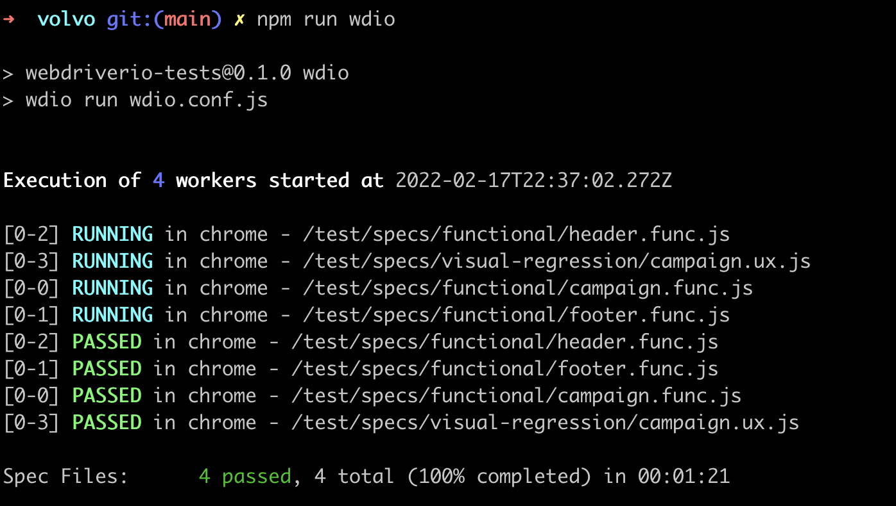
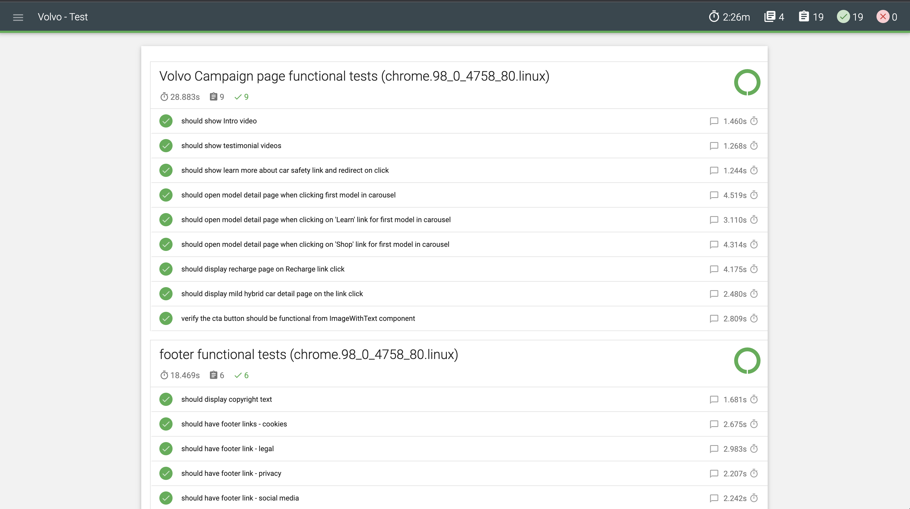

# volvo-automation-test
This repo contains a framework where you can write functional and visual regression tests using webdriver IO. 

[wdio-image-comparison-service](https://github.com/wswebcreation/wdio-image-comparison-service) for visual regression test.

[wdio-mochawesome-reporter](https://github.com/fijijavis/wdio-mochawesome-reporter) for generating reports.

### Pre requisites
1. node (>v14.x)   
Follow instructions to install nvm [here](https://github.com/nvm-sh/nvm#install--update-script)
    ```bash
    # install node version
    nvm install 14.17.0
    # set version as default
    nvm alias default 14.17.0
    ```
2. docker  
Follow instructions [here](https://docs.docker.com/desktop/#download-and-install) to install Docker desktop for Mac/Windows.   
3. docker-compose  
Follow instruction [here](https://docs.docker.com/compose/install/#install-compose) to install Docker compose. If you installed Docker desktop in the previous step then it includes docker compose as well.
### How to run tests
```bash
# clone the repo
git clone git@github.com:saranyas72/volvo-automation-test.git
# switch to root directoy
cd  volvo-automation-test
# run npm install
npm install
# run docker-compose to set up selenium hub with nodes for chrome, edge and firefox in the background
docker-compose up -d
# run tests all tests
npm run wdio
```

- Each individual spec file is run in parallel. The output below shows 4 workers running the 4 spec files 


- After test run, generates a report under mochawesome-report folder. Sample below


- Sample log from a full test run can be found in [sample-run.log](./sample-run.log)

- To run inidividual spec files run
```bash
npx wdio run wdio.conf.js --spec ./test/specs/functional/footer.func.js
```

### Repo structure

```
├── test
│   ├── assets
│   │   └── baseline-img # contains baseline images for visual regression tests
│   │       └── desktop_chrome
│   │           └── test-full-page-view--1050x978.png
│   ├── helpers
│   │   └── index.js
│   ├── pageobjects # page object model classes
│   │   ├── campaign.js
│   │   ├── footer.js
│   │   ├── header.js
│   │   └── page.js
│   └── specs
│       ├── functional # contains functional specs
│       │   ├── campaign.func.js
│       │   ├── footer.func.js
│       │   └── header.func.js
│       └── visual-regression # contains visual regression specs
│           └── campaign.ux.js
└── wdio.conf.js # webdriver IO config
```
### Test cases covered

| Test# | Test Case                                                                               | Test Suite       | Test type  |
|-------|-----------------------------------------------------------------------------------------|------------------|------------|
| 1     | should show Intro video                                                                 | Campaign.func.js | Functional |
| 2     | should show testimonial videos                                                          |                  | Functional |
| 3     | should show learn more about car safety link and redirect on click                      |                  | Functional |
| 4     | should open model detail page when clicking first model in carousel                     |                  | Functional |
| 5     | should open model detail page when clicking on 'Learn' link for first model in carousel |                  | Functional |
| 6     | should open model detail page when clicking on 'Shop' link for first model in carousel  |                  | Functional |
| 7     | should display recharge page on Recharge link click                                     |                  | Functional |
| 8     | should display mild hybrid car detail page on the link click                            |                  | Functional |
| 9     | verify the cta button should be functional from ImageWithText component                 |                  | Functional |
| 10    | should open and close side menu                                                         | Header.func.js   | Functional |
| 11    | should show our cars dropdown                                                           |                  | Functional |
| 12    | should navigate to About Volvo -> Sustainability                                        |                  | Functional |
| 13    | should display copyright text                                                           | Footer.func.js   | Functional |
| 14    | should have footer links  - cookies                                                     |                  | Functional |
| 15    | should have footer link  - legal                                                        |                  | Functional |
| 16    | should have footer link  - privacy                                                      |                  | Functional |
| 17    | should have footer link  - social media                                                 |                  | Functional |
| 18    | should have footer link  - tell us                                                      |                  | Functional |
| 19    | should verify the campaign page elements in full page view                              | campaign.ux.js   | Visual     |
